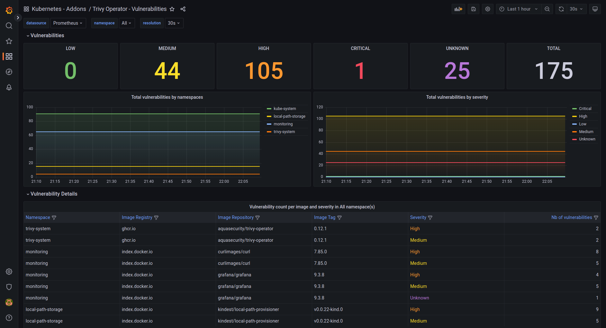
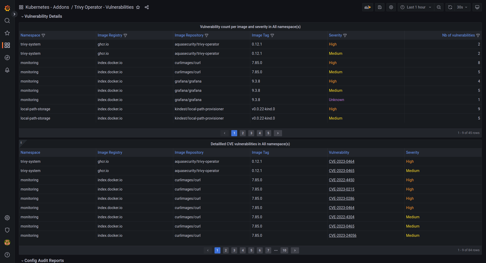
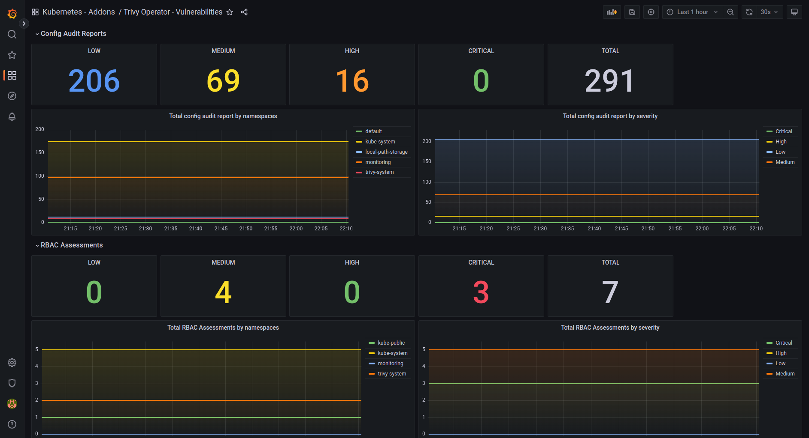
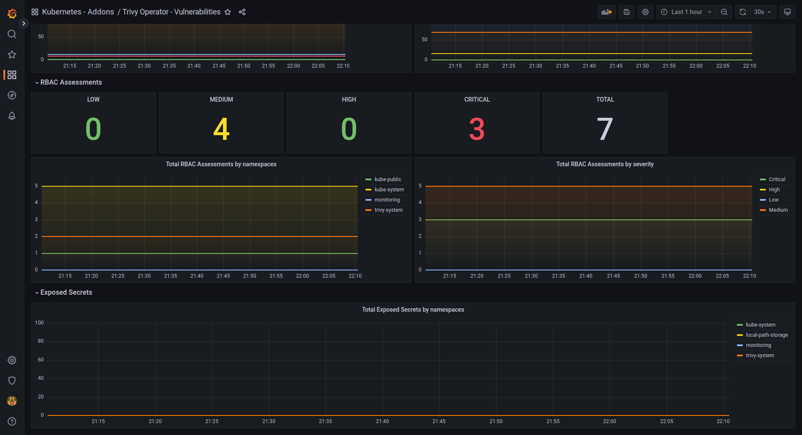

# Trivy Operator Dashboard for Kubernetes

This dashboard provides a comprehensive view of vulnerabilities and misconfigurations in your Kubernetes cluster, as detected by the Trivy Operator.

## Dashboard Overview

The Trivy Operator Dashboard offers several panels to help you visualize and understand the security posture of your Kubernetes environment.

### 1. Vulnerability Summary

This panel provides an at-a-glance view of the overall vulnerability status in your cluster. It shows:
- Total number of vulnerabilities
- Breakdown of vulnerabilities by severity (Critical, High, Medium, Low)
- Number of affected workloads

### 2. Misconfiguration Summary

This section focuses on misconfigurations detected in your Kubernetes resources. It displays:
- Total number of misconfigurations
- Breakdown of misconfigurations by severity
- Number of affected resources

### 3. Top Vulnerable Images

This panel lists the container images with the highest number of vulnerabilities. It helps you identify which images require immediate attention and remediation.

### 4. Vulnerabilities by Namespace

This visualization shows the distribution of vulnerabilities across different namespaces in your cluster. It allows you to quickly identify which namespaces have the most security issues.

## Using the Dashboard

To make the most of this dashboard:

1. Regularly review the vulnerability and misconfiguration summaries to understand your overall security posture.
2. Focus on critical and high severity issues first.
3. Use the "Top Vulnerable Images" panel to prioritize which container images to update or replace.
4. Analyze the "Vulnerabilities by Namespace" to identify which parts of your cluster need the most attention.

Remember, this dashboard is a tool to help you visualize and prioritize security issues. Always refer to the Trivy Operator's detailed reports for specific remediation steps.

## Setup

To use this dashboard, ensure you have:

1. Trivy Operator installed and running in your Kubernetes cluster.
2. Prometheus configured to scrape metrics from Trivy Operator.
3. Grafana connected to your Prometheus data source.

Import the `k8s-addons-trivy-operator.json` file into your Grafana instance to start using this dashboard.
